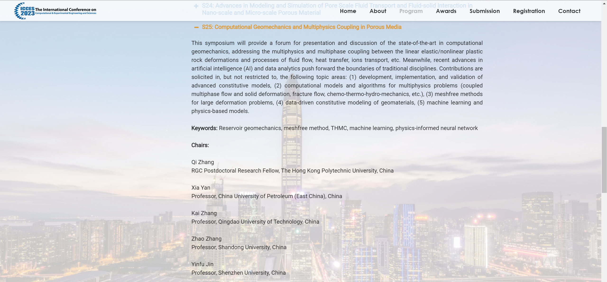

Welcome to my personal academic website!

I am Qi ZHANG (张琦 in Chinese) and I was born in Taian and raised in Qingdao.

Currently, I am a research assistant professor in the [Department of Civil and Environmental Engineering](https://www.polyu.edu.hk/cee/) at [The Hong Kong Polytechnic University](https://www.polyu.edu.hk/en/) (from 11/2022). I work with Prof. [Zhen-Yu Yin](https://www.polyu.edu.hk/cee/people/academic-staff/dr-zhen-yu-yin/). Prior to joining PolyU, I received my Ph.D. degree in the [Department of Civil and Environmental Engineering](https://cee.stanford.edu/) at [Stanford University](https://www.stanford.edu/) in June 2021, advised by Prof. [Ronaldo I. Borja](https://web.stanford.edu/~borja/). My Ph.D. thesis is **MATHEMATICAL MODELING OF UNCONVENTIONAL GEOMATERIALS**. I received my B.Eng. degree from [Tongji University](https://www.tongji.edu.cn/) in July 2016 with an undergraduate minor degree in Applied Mathematics.

My research interest focuses on the poromechanics theory developed by Prof. [Ronaldo I. Borja](https://web.stanford.edu/~borja/), Prof. [Alexander H.-D. Cheng](http://home.olemiss.edu/~acheng/), and Prof. [Olivier Coussy](https://doi.org/10.1002/nag.911). I am also eager to learn the Nonlinear Finite Element Methods, especially the finite-strain elastoplasticity in geomechanics. I collaborate with Prof. [Xia Yan](http://pe.upc.edu.cn/2019/1107/c14043a224742/page.htm) from the [Research Center of Multiphase Flow in Porous Media](http://oilcenter.pe.upc.edu.cn/main.htm) (led by Prof. Jun Yao).

Recent news
======

<!---

FA = First Author; CA = Corresponding Author

- (FA) Paper on anisotropic double porosity media and stabilized node-based smoothed finite element method (SNS-FEM) has been accepted for publication in *Computer Methods in Applied Mechanics and Engineering*. (September 18, 2022)

- (CA) Paper on roof water inrush study (wing crack initiation analytical solution and similar laboratory experiment) has been accepted for publication in *Engineering Failure Analysis*. (August 28, 2022)

- (FA) Paper on multiple porosity deformable media and multiphase flow has been accepted for publication in *Computers and Geotechnics*. (March 14, 2022)

--->

- Special Feature on **Multiscale Multiphysics Modeling in Geotechnical Engineering** has been published in the first issue of 2023 of Journal of Zhejiang University-SCIENCE A (January 25, 2023). The full text could be downloaded [here](../files/jzus.A22MMMiG.pdf){:target="_blank"}. Happy Chinese (Lunar) New Year!

- I have been awarded the Start-up Fund for RAPs under the Strategic Hiring Scheme (January 16, 2023). The proposal title is **Development of a novel geomechanical model for MHBS that incorporates effects of viscoplasticity, temperature, anisotropy, and non-Darcy flow**.

- The [Resources](https://qizhang94.github.io/resources/) section is updated with my own contributions (January 2, 2023)! Happy New Year!

- My CMAME paper has just received attentions from Prof. Abousleiman (Dec 27, 2022)! Thank you for the pioneers in poroelasticity and double porosity, without whom this work is not possible.

- I have given an online talk for the invited lecture from the China University of Petroleum (East China) SPE Student Chapter (November 18, 2022)

- I have been awarded the **RGC Postdoctoral Fellowship** (RGC Ref. No. PDFS2223-5S04) in the 2022/23 Exercise (April 26, 2022)

<!---
 

--->

