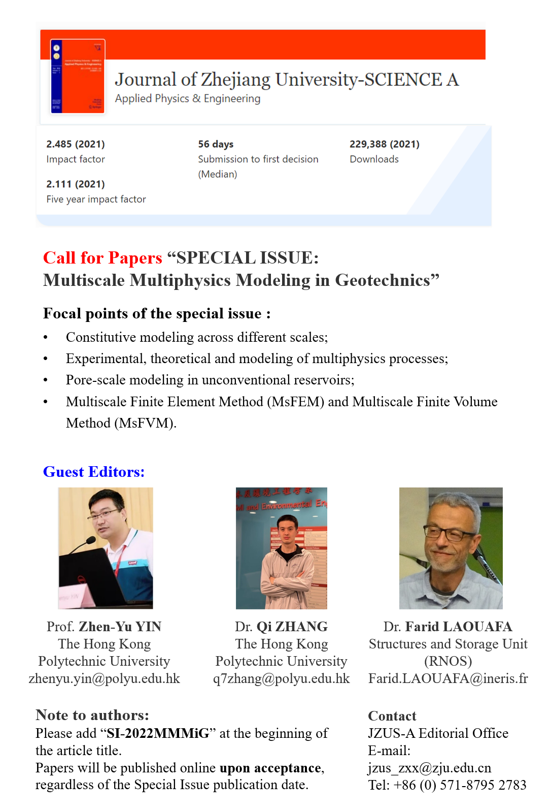
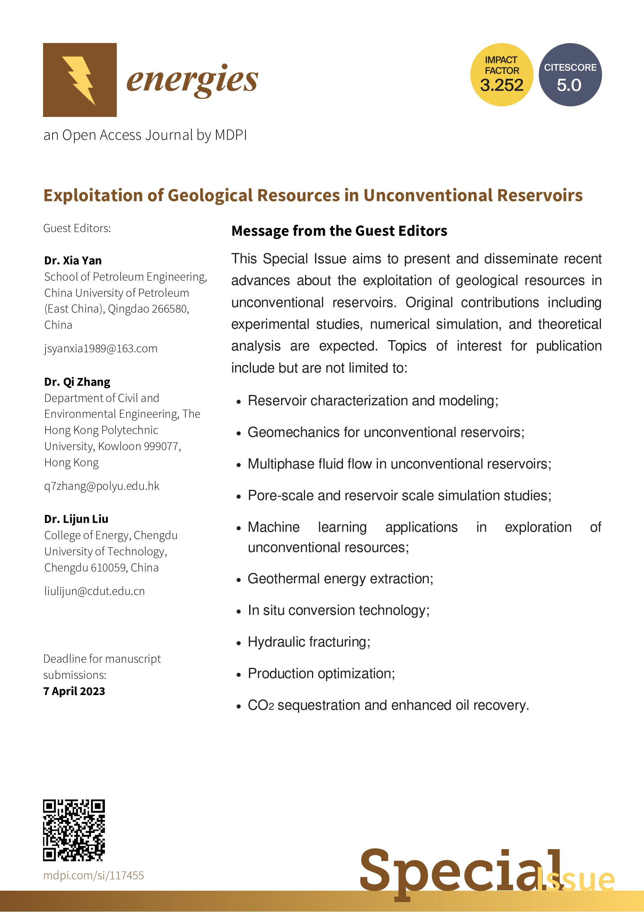

Welcome to my personal academic website!

I am Qi ZHANG (张琦 in Chinese) and I was born in Taian and raised in Qingdao.

Currently I am a research assistant professor in [Department of Civil and Environmental Engineering](https://www.polyu.edu.hk/cee/) at [The Hong Kong Polytechnic University](https://www.polyu.edu.hk/en/) (from 11/2022). I work with [Prof. Zhen-Yu Yin](https://www.polyu.edu.hk/cee/people/academic-staff/dr-zhen-yu-yin/). Prior to joining PolyU, I received my Ph.D. degree in [Department of Civil and Environmental Engineering](https://cee.stanford.edu/) at [Stanford University](https://www.stanford.edu/) in June 2021, advised by [Prof. Ronaldo I. Borja](https://web.stanford.edu/~borja/). My Ph.D. thesis is **MATHEMATICAL MODELING OF UNCONVENTIONAL GEOMATERIALS**. I received my B.Eng. degree from [Tongji University](https://www.tongji.edu.cn/) in July 2016 with an undergradute minor degree in Applied Mathematics.

My research interest focuses on the poromechanics theory developed by [Prof. Ronaldo I. Borja](https://web.stanford.edu/~borja/), [Prof. Alexander H.-D. Cheng](http://home.olemiss.edu/~acheng/), and [Dr. Olivier Coussy](https://doi.org/10.1002/nag.911). I am also eager to learn the Nonlinear Finite Element Methods especially the finite-strain elastoplasticity in geomechanics. I collaborate with [Prof. Xia Yan](http://pe.upc.edu.cn/2019/1107/c14043a224742/page.htm) from [Research Center of Multiphase Flow in Porous Media](http://oilcenter.pe.upc.edu.cn/main.htm) (led by Prof. Jun Yao) of China University of Petroleum (East China).

Recent news
======

FA = First Author; CA = Corresponding Author

- (FA) Paper on anistropic double porosity media and stabilized node-based smoothed finite element method (SNS-FEM) has been accepted for publication in *Computer Methods in Applied Mechanics and Engineering*. (September 18, 2022)

- (CA) Paper on roof water inrush study (wing crack initiation analytical solution and similar laboratory experiment) has been accepted for publication in *Engineering Failure Analysis*. (August 28, 2022)

- Dr. ZHANG has been awarded of the RGC Postdoctoral Fellowship in 2022/23 Exercise! (April 26, 2022)

- (FA) Paper on multiple porosity deformable media and multiphase flow has been accepted for publication in *Computers and Geotechnics*. (March 14, 2022)

 