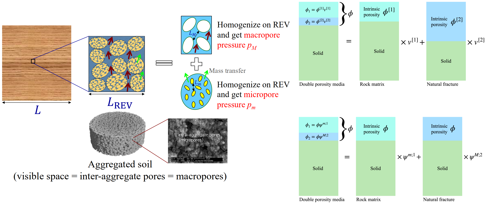
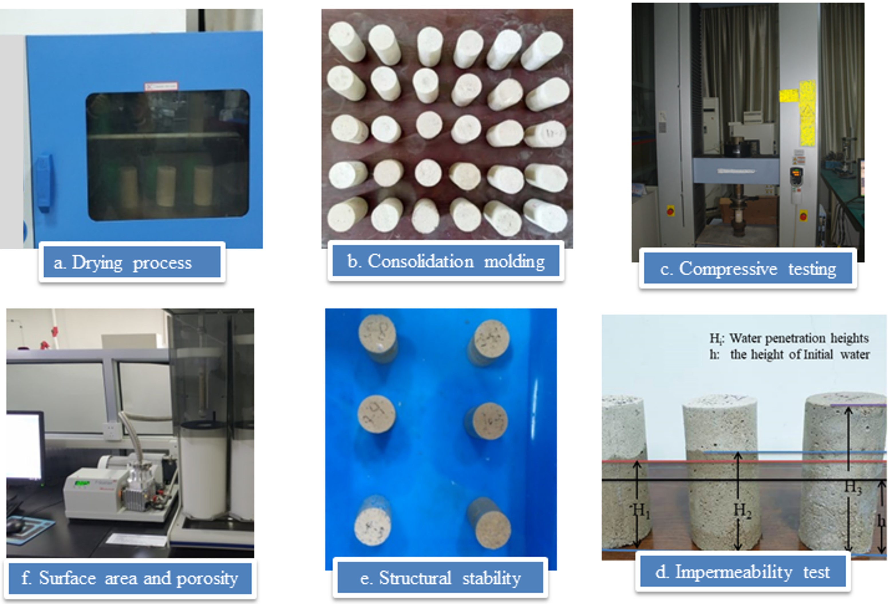

## Continuum modeling of double porosity media
- Self-consistent extension of linear poroelasticity to overlapping scales of porosity within fluid-saturated anisotropic materials is developed.

## Novel numerical scheme for multiphysics problems with large deformation
### [A basic in-house numerical simulator for hydromechanical coupling](https://github.com/qizhang94/GEOKEYFEM_HM)
- Deep footing indentation on a saturated porous media (Made by Ze-Yu WANG)

  

- Non-isothermal indentation for pure solid

## Gas production from fractured shale reservoirs

## Roof water inrush in mining engineering

